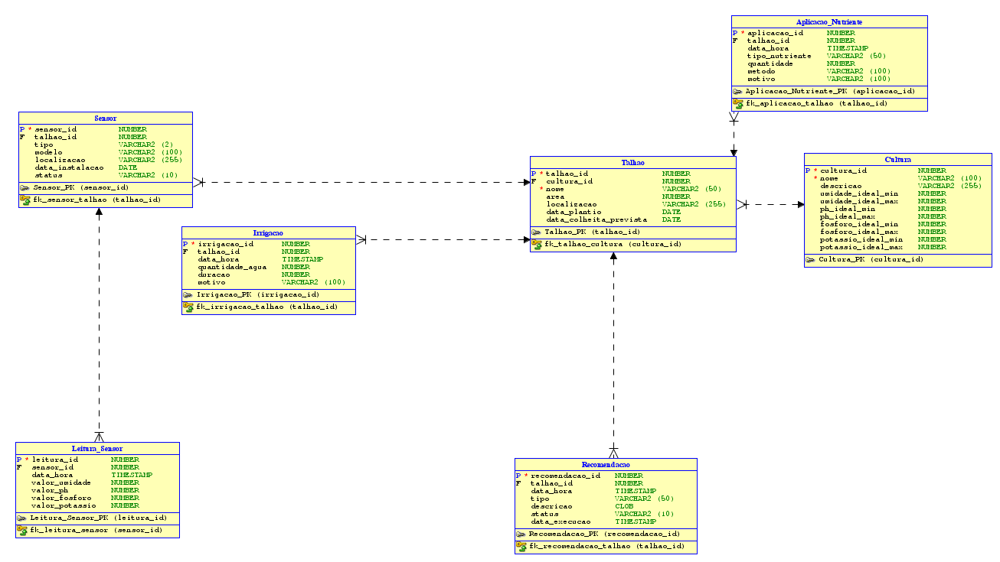

# Sistema de Sensoriamento Agrícola - FarmTech Solutions

## Descrição do Projeto
Este projeto implementa um sistema de armazenamento e análise de dados coletados por sensores em plantações, com o objetivo de otimizar a irrigação e a aplicação de nutrientes. O sistema permite monitorar diferentes culturas através de três tipos de sensores:
- S1: Sensor de umidade
- S2: Sensor de pH
- S3: Sensor de nutrientes (fósforo e potássio)

## Objetivo
Criar um sistema de banco de dados que permita armazenar, processar e analisar dados de sensores para ajustar a quantidade de água e nutrientes aplicados na plantação, otimizando a produção agrícola com base em dados históricos e em tempo real.

## Modelo Entidade-Relacionamento (MER)

### Entidades e Atributos

#### 1. Cultura
- **cultura_id** (PK): Identificador único da cultura
- **nome**: Nome da cultura
- **descricao**: Descrição da cultura
- **umidade_ideal_min**: Nível mínimo de umidade ideal
- **umidade_ideal_max**: Nível máximo de umidade ideal
- **ph_ideal_min**: Nível mínimo de pH ideal
- **ph_ideal_max**: Nível máximo de pH ideal
- **fosforo_ideal_min**: Nível mínimo de fósforo ideal
- **fosforo_ideal_max**: Nível máximo de fósforo ideal
- **potassio_ideal_min**: Nível mínimo de potássio ideal
- **potassio_ideal_max**: Nível máximo de potássio ideal

#### 2. Talhao (Área de plantio)
- **talhao_id** (PK): Identificador único do talhão
- **cultura_id** (FK): Referência à cultura plantada
- **nome**: Nome/código do talhão
- **area**: Área em hectares
- **localizacao**: Descrição da localização ou coordenadas
- **data_plantio**: Data em que foi plantado
- **data_colheita_prevista**: Data prevista para colheita

#### 3. Sensor
- **sensor_id** (PK): Identificador único do sensor
- **talhao_id** (FK): Referência ao talhão onde está instalado
- **tipo**: Tipo de sensor (S1, S2 ou S3)
- **modelo**: Modelo/fabricante do sensor
- **localizacao**: Coordenadas precisas
- **data_instalacao**: Data de instalação
- **status**: Estado atual (ativo, inativo, manutenção)

#### 4. Leitura_Sensor
- **leitura_id** (PK): Identificador único da leitura
- **sensor_id** (FK): Referência ao sensor
- **data_hora**: Data e hora da leitura
- **valor_umidade**: Valor de umidade (para sensores S1)
- **valor_ph**: Valor de pH (para sensores S2)
- **valor_fosforo**: Valor de fósforo (para sensores S3)
- **valor_potassio**: Valor de potássio (para sensores S3)

#### 5. Irrigacao
- **irrigacao_id** (PK): Identificador único da irrigação
- **talhao_id** (FK): Referência ao talhão irrigado
- **data_hora**: Data e hora da irrigação
- **quantidade_agua**: Volume de água aplicado (em litros)
- **duracao**: Duração da irrigação (em minutos)
- **motivo**: Razão da irrigação (automática, manual, programada)

#### 6. Aplicacao_Nutriente
- **aplicacao_id** (PK): Identificador único da aplicação
- **talhao_id** (FK): Referência ao talhão
- **data_hora**: Data e hora da aplicação
- **tipo_nutriente**: Tipo de nutriente aplicado (N, P, K ou composto)
- **quantidade**: Quantidade aplicada (em kg)
- **metodo**: Método de aplicação
- **motivo**: Razão da aplicação (automática, manual, programada)

#### 7. Recomendacao
- **recomendacao_id** (PK): Identificador único da recomendação
- **talhao_id** (FK): Referência ao talhão
- **data_hora**: Data e hora da recomendação
- **tipo**: Tipo de recomendação (irrigação, nutrientes)
- **descricao**: Descrição detalhada da recomendação
- **status**: Status da recomendação (pendente, executada, ignorada)
- **data_execucao**: Data de execução (se executada)

### Relacionamentos e Cardinalidade

- **Cultura (1) ---- (*) Talhao**: Uma cultura pode ser plantada em vários talhões, mas cada talhão tem apenas uma cultura.
- **Talhao (1) ---- (*) Sensor**: Um talhão pode ter vários sensores, mas cada sensor está em apenas um talhão.
- **Sensor (1) ---- (*) Leitura_Sensor**: Um sensor pode ter várias leituras, mas cada leitura pertence a apenas um sensor.
- **Talhao (1) ---- (*) Irrigacao**: Um talhão pode receber várias irrigações, mas cada irrigação é aplicada a apenas um talhão.
- **Talhao (1) ---- (*) Aplicacao_Nutriente**: Um talhão pode receber várias aplicações de nutrientes, mas cada aplicação é feita em apenas um talhão.
- **Talhao (1) ---- (*) Recomendacao**: Um talhão pode receber várias recomendações, mas cada recomendação é específica para apenas um talhão.

### Tipos de Dados

#### Oracle Database 12c

| Entidade | Atributo | Tipo de Dado |
|----------|----------|--------------|
| Cultura | cultura_id | NUMBER |
| Cultura | nome | VARCHAR2(100) |
| Cultura | descricao | VARCHAR2(255) |
| Cultura | umidade_ideal_min | NUMBER |
| Cultura | umidade_ideal_max | NUMBER |
| Cultura | ph_ideal_min | NUMBER |
| Cultura | ph_ideal_max | NUMBER |
| Cultura | fosforo_ideal_min | NUMBER |
| Cultura | fosforo_ideal_max | NUMBER |
| Cultura | potassio_ideal_min | NUMBER |
| Cultura | potassio_ideal_max | NUMBER |
| Talhao | talhao_id | NUMBER |
| Talhao | cultura_id | NUMBER |
| Talhao | nome | VARCHAR2(50) |
| Talhao | area | NUMBER |
| Talhao | localizacao | VARCHAR2(255) |
| Talhao | data_plantio | DATE |
| Talhao | data_colheita_prevista | DATE |
| Sensor | sensor_id | NUMBER |
| Sensor | talhao_id | NUMBER |
| Sensor | tipo | VARCHAR2(2) |
| Sensor | modelo | VARCHAR2(100) |
| Sensor | localizacao | VARCHAR2(255) |
| Sensor | data_instalacao | DATE |
| Sensor | status | VARCHAR2(10) |
| Leitura_Sensor | leitura_id | NUMBER |
| Leitura_Sensor | sensor_id | NUMBER |
| Leitura_Sensor | data_hora | TIMESTAMP |
| Leitura_Sensor | valor_umidade | NUMBER |
| Leitura_Sensor | valor_ph | NUMBER |
| Leitura_Sensor | valor_fosforo | NUMBER |
| Leitura_Sensor | valor_potassio | NUMBER |
| Irrigacao | irrigacao_id | NUMBER |
| Irrigacao | talhao_id | NUMBER |
| Irrigacao | data_hora | TIMESTAMP |
| Irrigacao | quantidade_agua | NUMBER |
| Irrigacao | duracao | NUMBER |
| Irrigacao | motivo | VARCHAR2(100) |
| Aplicacao_Nutriente | aplicacao_id | NUMBER |
| Aplicacao_Nutriente | talhao_id | NUMBER |
| Aplicacao_Nutriente | data_hora | TIMESTAMP |
| Aplicacao_Nutriente | tipo_nutriente | VARCHAR2(50) |
| Aplicacao_Nutriente | quantidade | NUMBER |
| Aplicacao_Nutriente | metodo | VARCHAR2(100) |
| Aplicacao_Nutriente | motivo | VARCHAR2(100) |
| Recomendacao | recomendacao_id | NUMBER |
| Recomendacao | talhao_id | NUMBER |
| Recomendacao | data_hora | TIMESTAMP |
| Recomendacao | tipo | VARCHAR2(50) |
| Recomendacao | descricao | CLOB |
| Recomendacao | status | VARCHAR2(10) |
| Recomendacao | data_execucao | TIMESTAMP |

## Diagrama Entidade-Relacionamento (DER)

O diagrama visual do modelo relacional foi criado utilizando o SQL Developer Data Modeler da Oracle. O diagrama mostra todas as entidades, seus atributos e os relacionamentos entre elas, conforme descrito acima.

## Implementação

Para implementar este modelo:

1. Importe o arquivo `.ddl` no SQL Developer Data Modeler
2. Gere o diagrama visual
3. Refine o modelo conforme necessário
4. Exporte o script SQL para criar as tabelas em um banco de dados Oracle 12c

## Casos de Uso do Banco de Dados

Este banco de dados permitirá responder a questões como:

1. Qual foi a quantidade total de água aplicada em cada talhão por mês?
2. Como variou o nível de pH do solo ao longo do ano?
3. Quais talhões precisam de ajustes urgentes nos níveis de nutrientes?
4. Qual a correlação entre os níveis de umidade e a aplicação de água?
5. Quais são as recomendações pendentes para um determinado talhão?
6. Qual o histórico de aplicação de nutrientes em uma cultura específica?
7. Quais sensores estão precisando de manutenção?

## Equipe

Este projeto foi desenvolvido por:
- Gustavo Zanette Martins

## Ferramentas Utilizadas

- SQL Developer Data Modeler (Oracle)
- Oracle Database 12c
- GitHub para versionamento e colaboração

---

© FarmTech Solutions - 2025
